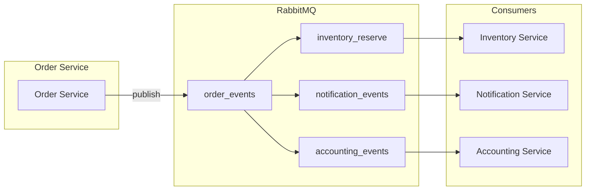

# ChainWise — описание проекта

| | |
|---|---|
| **Версия** | 1.0 |
| **Дата** | 27.02.2026 |

Полное описание ERP-платформы ChainWise: назначение, архитектура, взаимодействие сервисов, цепочки запросов и тестовые сценарии.  
Исходные требования: [ChainWise-TZ.md](ChainWise-TZ.md).

---

## Содержание

1. [Описание проекта](#1-описание-проекта)
2. [Архитектура и сервисы](#2-архитектура-и-сервисы)
3. [Технологии](#3-технологии)
4. [Схемы взаимодействия сервисов](#4-схемы-взаимодействия-сервисов)
5. [Цепочки запросов и ответов](#5-цепочки-запросов-и-ответов)
6. [Тестовые сценарии](#6-тестовые-сценарии)
7. [Глоссарий](#7-глоссарий)

---

## 1. Описание проекта

### 1.1. Назначение

ChainWise — система автоматизации цепочки поставок:

- **Внешняя закупка:** пополнение центрального склада (ЦС) от поставщиков; учёт накладных и цен.
- **Внутренние поставки:** заявки филиалов (точек быстрого питания) на товар со склада, резервирование, сборка, доставка курьером и фиксация прихода на филиал.

Все операции выполняются с планшетов в едином адаптивном приложении; интерфейс зависит от роли (оператор точки, кладовщик, курьер, администратор). Списки заказов обновляются в реальном времени через WebSocket.

### 1.2. Роли и границы

| Роль | Кто видит заказы | Ключевые действия |
|------|-------------------|-------------------|
| Оператор филиала | Только заказы своей точки | Создание заказа (если есть право), назначение заказа на курьера |
| Кладовщик | Все заказы | Сборка, вывод QR, учёт внешней закупки |
| Курьер | Только свои заказы | Забор (QR/кнопка), доставка на филиал (QR/кнопка) |
| Администратор | — | Настройки, пользователи, роли, отчёты |

Право «создание заказа» выдаётся в IAM только одному сотруднику точки из 2–3 работающих.

### 1.3. Назначение курьера

- **Pull:** курьер сам выбирает заказ из витрины доступных заказов.
- **Push:** оператор филиала назначает заказ на выбранного курьера.

Один заказ привязан к одному курьеру.

---

## 2. Архитектура и сервисы

### 2.1. Высокоуровневая схема

```
                    +------------------+
                    |   Клиенты        |
                    | (планшеты, экран)|
                    +--------+---------+
                             |
                             | REST/WebSocket
                             v
                    +------------------+
                    |  API Gateway      |
                    |  (единый шлюз)    |
                    +--------+---------+
                             |
         +-------------------+-------------------+
         |                   |                   |
         v                   v                   v
+----------------+  +----------------+  +----------------+
| IAM Service    |  | Order Service  |  | Delivery Svc   |
| (JWT, роли)    |  | (заказы, QR)  |  | (назначение,   |
+----------------+  +--------+-------+  |  подтверждения)|
                     |        |        +----------------+
                     |        |                 |
                     v        v                 |
              +-------+--------+         +------+------+
              | Inventory Svc |         | Accounting |
              | (остатки,     |         | (проводки, |
              |  резерв)       |         |  закупки)   |
              +----------------+         +------------+
                     ^                            ^
                     |                            |
                     +-----------+    +------------+
                                 |    |
                         +-------+----+-------+
                         |   RabbitMQ        |
                         | order_events      |
                         +-------+-----------+
                                 |
                         +------+--------+
                         | Notification  |
                         | (WebSocket)   |
                         +---------------+
```

### 2.2. Сервисы и ответственность

| Сервис | Назначение | БД | Внешние вызовы |
|--------|------------|-----|----------------|
| **IAM** | Учётные записи, роли, JWT, проверка прав | PostgreSQL, Redis (сессии) | — |
| **Order** | Жизненный цикл заказа, State Machine, генерация/валидация QR-токенов, публикация событий | PostgreSQL | — (публикует в RabbitMQ) |
| **Inventory** | Остатки по локациям, асинхронный резерв по событиям, ручное списание | PostgreSQL | gRPC от Accounting (приход при закупке); по событию — перевод заказа в отмену (Order) |
| **Accounting** | Закупки, накладные, проводки «Склад → Филиал», аналитика | PostgreSQL | gRPC к Inventory (увеличение остатков при закупке) |
| **Delivery** | Назначение заказа на курьера (pull/push), обработка подтверждений забора/доставки | PostgreSQL | gRPC к Order (валидация QR, смена статуса) |
| **Notification** | Real-time списки заказов: экран склада, планшеты (по роли/контексту) | — (опционально Redis для подписок) | Подписка на RabbitMQ |

### 2.3. State Machine заказа

```
Created → Reserved → InProgress → ReadyForPickup → InTransit → Delivered
    |           |
    +-----------+------→ Cancelled (ошибка резерва / отмена)
```

- **Created:** заказ создан, событие `order.created` опубликовано; резерв выполняется асинхронно.
- **Reserved:** Inventory успешно зарезервировал товар.
- **InProgress:** кладовщик приступил к сборке.
- **ReadyForPickup:** собран, ожидает забора курьером.
- **InTransit:** курьер забрал, везёт на филиал.
- **Delivered:** передача на филиале подтверждена, заказ закрыт.
- **Cancelled:** отмена или исчерпание повторов резервирования.

---

## 3. Технологии

### 3.1. Общий стек

| Компонент | Технология |
|-----------|------------|
| Backend | Go 1.24+ |
| Межсервисное взаимодействие | gRPC (Protocol Buffers v3) |
| Внешний API | REST/JSON через единый API Gateway (gRPC-Gateway или аналог) |
| Очереди | RabbitMQ (exchange: topic, Publisher Confirms, DLX) |
| БД сервисов | PostgreSQL 16 (у каждого сервиса своя БД) |
| Сессии/кэш | Redis (IAM и при необходимости другие сервисы) |
| Контракты | .proto в отдельном Git-репозитории (модуль) |
| Real-time на клиенте | WebSocket или SSE |

### 3.2. По сервисам

| Сервис | Стек |
|--------|------|
| IAM | Go, PostgreSQL, Redis, JWT, gRPC |
| Order | Go, PostgreSQL, RabbitMQ (publish), gRPC |
| Inventory | Go, PostgreSQL, RabbitMQ (consume), gRPC |
| Accounting | Go, PostgreSQL, RabbitMQ (consume), gRPC |
| Delivery | Go, PostgreSQL, gRPC (клиент к Order) |
| Notification | Go, RabbitMQ (consume), WebSocket/SSE |
| API Gateway | Отдельный деплой; маршрутизация к сервисам, опционально gRPC-Gateway |

### 3.3. RabbitMQ

- **Exchange:** `order_events` (topic).
- **Routing keys:** `order.created`, `order.reserved`, `order.in_progress`, `order.ready_for_pickup`, `order.in_transit`, `order.delivered`, `order.cancelled`.
- **Очереди:** `inventory_reserve` (Inventory), `notification_events` (Notification), `accounting_events` (Accounting).
- **Binding:** `order.created` → inventory_reserve, notification_events; все события заказа → notification_events; `order.delivered` → accounting_events.
- **Надёжность:** Publisher Confirms, Dead Letter Exchange (DLX) для необработанных сообщений.

---

## 4. Схемы взаимодействия сервисов

### 4.1. RabbitMQ (события заказа)



- Order публикует в `order_events` с routing key по статусу.
- Inventory подписан на `order.created`; при ошибке резерва — retry; при исчерпании — перевод заказа в Cancelled (согласование с Order).
- Notification подписан на все события заказа и рассылает обновления по WebSocket клиентам (по роли/контексту).
- Accounting подписан на `order.delivered` и закрывает проводку.

### 4.2. gRPC-вызовы (синхронные)

| От кого | Кому | Действие |
|---------|------|-----------|
| API Gateway / клиент | IAM | Проверка JWT, выдача токена |
| Клиент (через Gateway) | Order | Создание заказа, смена статуса, генерация/валидация QR |
| Клиент (через Gateway) | Delivery | Назначение заказа на курьера (pull/push), подтверждение забора/доставки |
| Delivery | Order | Валидация QR-токена, запрос смены статуса (забор/доставка) |
| Клиент (кладовщик) | Accounting | Регистрация внешней закупки |
| Accounting | Inventory | Увеличение остатков на ЦС после закупки |
| Inventory | Order | (При необходимости) запрос перевода заказа в Cancelled при исчерпании retry резерва |

---

## 5. Цепочки запросов и ответов

### 5.1. Создание заказа (внутренняя поставка, начало)

```
1. Клиент (оператор точки, планшет)
   → POST /api/orders (или gRPC CreateOrder)
   → API Gateway → Order Service

2. Order Service:
   - Сохраняет заказ (status=Created) и позиции заказа: номенклатура (product_id), количество, цена за единицу на момент создания (unit_price_cents)
   - Публикует в RabbitMQ: exchange=order_events, routing_key=order.created, body={order_id, branch_id, items: [{product_id, quantity, unit_price_cents}], ...}
   - Ответ клиенту: 201, {order_id, status: "created"}

3. Параллельно (асинхронно):
   - Inventory Service (consumer inventory_reserve):
     - Резервирует товар по заказу
     - При успехе: может уведомить Order (gRPC или событие order.reserved) для смены статуса на Reserved
     - При ошибке: retry; при исчерпании — вызов Order для перевода в Cancelled
   - Notification Service (consumer notification_events):
     - Рассылает обновление списка заказов подключённым клиентам (экран склада, планшеты кладовщиков, планшет оператора точки по branch_id)
```

### 5.2. Назначение курьера (pull — курьер сам выбирает)

```
1. Клиент (курьер)
   → POST /api/delivery/orders/{order_id}/claim (или gRPC ClaimOrder)
   → API Gateway → Delivery Service

2. Delivery Service:
   - Проверяет, что заказ в статусе ReadyForPickup (или допустимом для назначения)
   - Привязывает order_id к courier_id
   - Опционально вызывает Order для обновления (или только локально)
   - Ответ: 200, {order_id, status: "assigned"}

3. Notification получает событие (если Order публикует смену) и обновляет списки у курьера и на экране склада.
```

### 5.3. Назначение курьера (push — оператор назначает)

```
1. Клиент (оператор точки)
   → POST /api/delivery/orders/{order_id}/assign (body: {courier_id})
   → API Gateway → Delivery Service

2. Delivery Service:
   - Проверяет права (оператор точки, свой филиал)
   - Привязывает order_id к courier_id
   - Ответ: 200

3. Notification обновляет списки (курьер видит новый заказ).
```

### 5.4. Забор со склада (QR)

```
1. Курьер сканирует QR на планшете → клиент получает order_id + token.

2. Клиент (курьер)
   → POST /api/delivery/confirm-pickup (body: {order_id, token})
   → API Gateway → Delivery Service

3. Delivery Service:
   → gRPC Order.ValidateQR(order_id, token, action=pickup)
   Order Service проверяет токен и статус заказа; возвращает OK или ошибку.

4. Delivery Service:
   → gRPC Order.TransitionStatus(order_id, status=InTransit)
   Order Service переводит статус и публикует order.in_transit.

5. Ответ клиенту: 200, {status: "in_transit"}

6. Notification рассылает обновление списков.
```

### 5.5. Доставка на филиал (QR)

```
1. На филиале курьер/оператор сканирует QR (или нажимает «Подтвердить передачу»).

2. Клиент
   → POST /api/delivery/confirm-delivery (body: {order_id, token})
   → API Gateway → Delivery Service

3. Delivery → Order.ValidateQR + Order.TransitionStatus(order_id, status=Delivered).

4. Order Service публикует order.delivered.

5. Accounting Service (consumer accounting_events):
   - Закрывает проводку «Склад → Филиал», фиксирует приход на филиал.

6. Notification рассылает обновление (заказ исчезает из активных у курьера и точки).
```

### 5.6. Внешняя закупка

```
1. Клиент (кладовщик)
   → POST /api/accounting/purchases (body: {supplier_id, document_ref, items[], prices})
   → API Gateway → Accounting Service

2. Accounting Service:
   - Сохраняет финансовую запись о закупке
   - gRPC Inventory.IncreaseStock(location_id=ЦС, items[])
   Inventory Service увеличивает остатки на ЦС.

3. Ответ клиенту: 201, {purchase_id, ...}
```

### 5.7. Получение списка заказов и real-time обновления

```
1. Список (первичная загрузка):
   Клиент → GET /api/orders?role=warehouse|branch|courier&branch_id=...|courier_id=...
   → API Gateway → Order Service (или Delivery для «мои заказы»)
   Ответ: 200, {orders: [...]}

2. Подписка на обновления:
   Клиент → WebSocket /api/notifications/orders (с JWT и query: role, branch_id, courier_id)
   → API Gateway → Notification Service
   Notification подписан на RabbitMQ (notification_events); при получении события рассылает клиентам обновлённый список или дифф по каналу WebSocket.
```

---

## 6. Тестовые сценарии

### 6.1. Внутренняя поставка (happy path)

| Шаг | Действие | Ожидаемый результат |
|-----|----------|---------------------|
| 1 | Оператор точки (с правом создания заказа) создаёт заказ с планшета | Заказ в статусе Created; событие order.created в RabbitMQ |
| 2 | Ожидание обработки Inventory | Заказ переходит в Reserved (или остаётся Created до события); на экране склада и у кладовщика появляется заказ |
| 3 | Кладовщик открывает заказ, запускает сборку | Статус InProgress; событие order.in_progress |
| 4 | Кладовщик завершает сборку, выводит QR | Статус ReadyForPickup; событие order.ready_for_pickup; QR содержит order_id и одноразовый токен |
| 5 | Курьер в приложении выбирает заказ из витрины (pull) | Заказ привязан к курьеру; курьер видит его в «Мои заказы» |
| 6 | Курьер сканирует QR забора | Order.ValidateQR успешен; статус InTransit; событие order.in_transit |
| 7 | На филиале курьер/оператор сканирует QR доставки | Order.ValidateQR успешен; статус Delivered; событие order.delivered |
| 8 | Проверка Accounting | Проводка «Склад → Филиал» создана; приход на филиал зафиксирован |
| 9 | Списки на планшетах | У оператора точки заказ в «Доставлено» или убран из активных; у курьера заказ убран из списка |

### 6.2. Назначение курьера оператором (push)

| Шаг | Действие | Ожидаемый результат |
|-----|----------|---------------------|
| 1 | Заказ в статусе ReadyForPickup | Виден оператору точки (свои заказы) и на экране склада |
| 2 | Оператор точки вызывает «Назначить курьера», выбирает курьера | Delivery привязывает заказ к выбранному курьеру |
| 3 | У выбранного курьера в приложении | Заказ появляется в «Мои заказы» |
| 4 | Дальнейшие шаги | Как в сценарии 6.1 (забор QR, доставка QR) |

### 6.3. Ошибка резервирования и отмена заказа

| Шаг | Действие | Ожидаемый результат |
|-----|----------|---------------------|
| 1 | Оператор создаёт заказ; в Inventory недостаточно остатков или временная ошибка | Order создан (Created), order.created опубликован |
| 2 | Inventory обрабатывает order.created, резерв падает с ошибкой | Retry по политике (например, 3 попытки) |
| 3 | После исчерпания retry | Inventory уведомляет Order (gRPC или событие); Order переводит заказ в Cancelled; публикуется order.cancelled |
| 4 | Notification рассылает обновление | Заказ исчезает из активных на экране склада и у оператора точки; в списке отображается как отменённый |

### 6.4. Внешняя закупка

| Шаг | Действие | Ожидаемый результат |
|-----|----------|---------------------|
| 1 | Кладовщик с планшета вносит данные закупки (поставщик, накладная, номенклатура, цены) | Accounting сохраняет запись; gRPC вызов к Inventory |
| 2 | Inventory увеличивает остатки по ЦС | Остатки на центральном складе обновлены |
| 3 | Ответ клиенту | 201, идентификатор закупки; при необходимости список остатков обновлён в UI |

### 6.5. QR: валидация и запасной вариант

| Шаг | Действие | Ожидаемый результат |
|-----|----------|---------------------|
| 1 | Курьер сканирует корректный QR забора | Order.ValidateQR возвращает OK; Delivery инициирует смену статуса на InTransit |
| 2 | Курьер сканирует повторно тот же QR (двойной скан) | Order отклоняет (токен одноразовый или статус уже изменён); ошибка 4xx клиенту |
| 3 | Курьер нажимает «Подтвердить передачу» без скана (запасной вариант) | Delivery принимает запрос (с order_id и при необходимости проверкой прав); Order переводит статус без проверки токена (или по внутреннему правилу) |
| 4 | Скан QR с истёкшим или неверным токеном | Order.ValidateQR возвращает ошибку; клиент получает сообщение об ошибке |

### 6.6. Права доступа

| Шаг | Действие | Ожидаемый результат |
|-----|----------|---------------------|
| 1 | Оператор точки без права «создание заказа» вызывает создание заказа | IAM/Gateway возвращает 403 |
| 2 | Оператор точки А запрашивает список заказов точки Б | Только заказы своей точки (branch_id из JWT); заказы точки Б не возвращаются |
| 3 | Курьер запрашивает список заказов | Только заказы, назначенные на данного курьера |
| 4 | Кладовщик запрашивает список заказов | Все заказы (не отфильтрованы по филиалу/курьеру) |

### 6.7. Real-time обновления

| Шаг | Действие | Ожидаемый результат |
|-----|----------|---------------------|
| 1 | Клиент (экран склада) подключается по WebSocket с role=warehouse | Notification принимает подключение |
| 2 | В системе создаётся новый заказ (другой клиент) | Order публикует order.created → Notification получает событие и отправляет обновление по WebSocket экрану склада |
| 3 | На экране склада | Новый заказ появляется в списке без перезагрузки страницы |
| 4 | Оператор точки подключён с branch_id=X | Получает обновления только по заказам филиала X |

---

## 7. Глоссарий

| Термин | Определение |
|--------|-------------|
| ЦС | Центральный склад. |
| ТМЦ | Товарно-материальные ценности. |
| Филиал / точка | Точка быстрого питания (торговая точка). |
| Внутренняя операция | Поставка товара со склада на филиал (списание со склада, приход на филиал). |
| Внешняя закупка | Закупка у внешнего поставщика и пополнение ЦС. |
| Позиция заказа | Строка заказа: номенклатура (product_id), количество, цена за единицу на момент создания заказа (unit_price_cents); используется для проводок и отображения. |
| QR-токен | Идентификатор заказа + одноразовый токен; генерация и валидация в Order Service. |

---

*Конец документа.*
